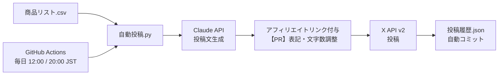

# Amazonアフィリエイト × Claude × X 自動投稿

Amazonアソシエイトの商品を Claude（Anthropic API）で紹介文にし、X（旧Twitter）へ自動投稿する仕組み。
GitHub Actions のスケジュール実行で完全放置運用が可能。

## 仕組み



- 商品の選び方: 一番長く投稿していない商品を自動選択（未投稿を最優先）
- 投稿文: Claude が商品の特徴から体験談風の文面とハッシュタグを JSON で生成
- 法令対応: 先頭に「【PR】」を自動付与（ステマ規制対応）
- 文字数: X の重み付き文字数（全角2・URL23）を計算し、上限 280 に自動調整
- 履歴: 投稿ごとに `投稿履歴.json` へ追記し、Actions が自動コミット

## ファイル構成

| ファイル | 役割 |
|---|---|
| `自動投稿.py` | メイン。商品選択 → 生成 → 投稿 → 履歴保存 |
| `投稿文生成.py` | Claude API 呼び出し（構造化出力・拒否時フォールバック） |
| `X投稿.py` | X API 投稿、文字数計算、投稿文の組み立て |
| `アフィリエイトリンク.py` | ASIN + トラッキングID からリンク生成 |
| `商品リスト.csv` | 投稿する商品の一覧（ここを編集して商品を追加） |
| `投稿履歴.json` | 投稿済み記録（自動更新） |
| `テスト_自動投稿.py` | ユニットテスト |
| `環境変数の設定例.txt` | `.env` の雛形 |
| `.github/workflows/自動投稿.yml` | 定期実行ワークフロー |
| `導入手順.md` | セットアップ手順（API取得〜運用開始） |

## クイックスタート

```bash
pip install -r requirements.txt
cp 環境変数の設定例.txt .env   # 値を書き換える
python 自動投稿.py --dry-run     # 投稿せず文面確認
python 自動投稿.py               # 実際に投稿
python -m unittest テスト_自動投稿 -v   # テスト
```

詳細は `導入手順.md` を参照。
